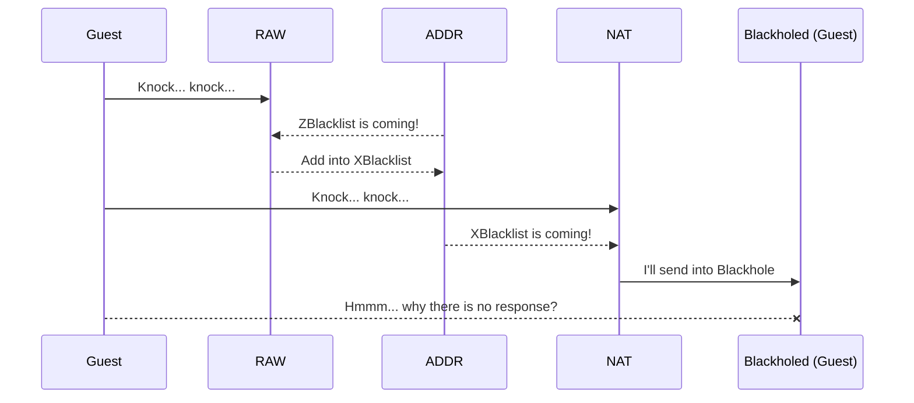

# Install ZBlacklist

StackEdit stores your files in your browser, which means all your files are automatically saved locally and are accessible **offline!**

## 1. Create a new script
Go to `/system scripts` and create a new script (i.e, zblacklist-updater)

    # Script: zblacklist-updater
    
    :local url "https://raw.githubusercontent.com/lokadns/tik/refs/heads/main/address-list/zblacklist.rsc";    
    :local fileName "zblacklist.rsc"; #or onto your usb drive
    :local isError false;
    
    :do {
        # download file
        /tool fetch url=$url mode=https dst-path=$fileName;
    } on-error {
        :set isError true;
    }
    :delay 2s;
    
    if ($isError=true) do={
        :log warning "Fetch $addressListName failed!";
    } else={
        # mute log
        /system/logging/set disabled=yes numbers=0;
        
        # remove old address-list using timeout (no logs) and wait 10 seconds
        /ip firewall address-list set [find list=ZBlacklist && comment!=manual] timeout=00:00:02
        :delay 10;
        
        # import a new address-list and wait 3 seconds
        /import file-name=$fileName;
        :delay 3;
        
        # unmute log
        /system/logging/set disabled=no numbers=0;
        :delay 3;
        
        :log warning "ZBlacklist has been updated!";
    }

## 2. Create scheduler
Go to `/system scheduler` and create two schedules: routine updater and on startup. 

    # Example scheduler: 
    /system scheduler
    add name=schedule1 \
        on-event=zblacklist-updater \
        policy=ftp,reboot,read,write,policy,test,password,sniff,sensitive,romon \
        start-time=01:00:00 \
	      interval=1d 
    add name=schedule2 \
        on-event=zblacklist-updater \
	      policy=ftp,reboot,read,write,policy,test,password,sniff,sensitive,romon \
        start-time=startup
        

---

# Deploy ZBlacklist
There are many ways to stop the attack into Mikrotik. Here just one example using RAW and NAT for blackholing, and this method, in my experience, reduced or slowed down the requests to my router.

## 1. Add blackhole routing table

    # Create rtab-toBlackhole
    /routing table
    add name=rtab-toBlackhole disabled=no 

## 2. Create /ip/route

    # Use local subnet (i.e. 172.31.255.0/24) as blackhole ip address, and
    # make sure this ip not attached into any interface (ether/vlan/bridge)
    /ip route 
    add blackhole disabled=no distance=1 dst-address=172.31.255.0/24 \
        routing-table=rtab-toBlackhole 

## 3. Utilitize ZBlacklist in RAW

    /ip firewall raw
    add action=add-src-to-address-list address-list=XBlacklist \
        address-list-timeout=1h chain=prerouting comment=Blacklist \
        in-interface-list=WAN src-address-list=ZBlacklist disabled=no 
    add action=add-src-to-address-list address-list=XBlacklist \
        address-list-timeout=30m chain=prerouting comment="DHCP/SSH/Telnet" \
        in-interface-list=WAN protocol=tcp dst-port=53,22,23 disabled=yes 

If you want to open SSH for local network and block it from the internet (WAN), feel free to enable the second rule.

## 4. Add blackholing in NAT

    /ip firewall nat
    add action=dst-nat chain=dstnat comment="Blackhole XBlacklist (subnet 172.31.255.0/24)" \
    src-address-list=XBlacklist to-addresses=172.31.255.1

See step 2 above and adjust the ip-address: `to-addresses=172.31.255.1`.

### Diagram

---

# Sources
This ZBlacklist compiled daily from 3 sources:

 1. Joshaven.com - https://joshaven.com (spamhaus, dshield, and bruteforce)
 2. Cinsscore.com - https://cinsscore.com/list/ci-badguys.txt
 3. Stamparam IPsum - https://github.com/stamparm/ipsum (Level 8, 7, and 6)

The first time compiled these sources, it generated 17857 unique ip addresses. Small enough to be combined into a single file. Hope it stays small and firm.
